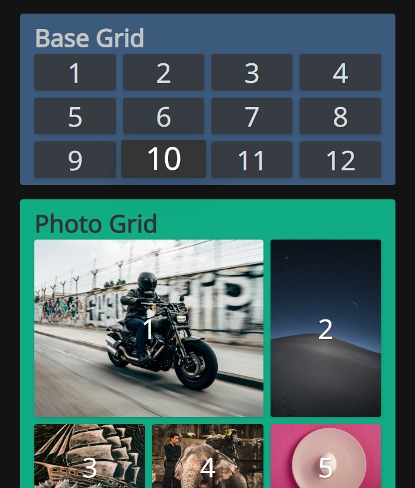

# The Joy of CSS Grid
CSS grid layout and animation examples.

## Features
- Responsive 12-column bootstrap replacement
- Mosaic photo gallery
- Staggered animation grid
- Hover effects and animation

# Examples

## Usage
1. Compile SCSS files \
  `npm run build` OR `npm run watch`

2. Open `public/index.html` in your browser. 

---
## Credits
[@fireship-io](https://github.com/fireship-io) - [The Joy of CSS Grid (Tutorial)](https://www.youtube.com/watch?v=705XCEruZFs) 
